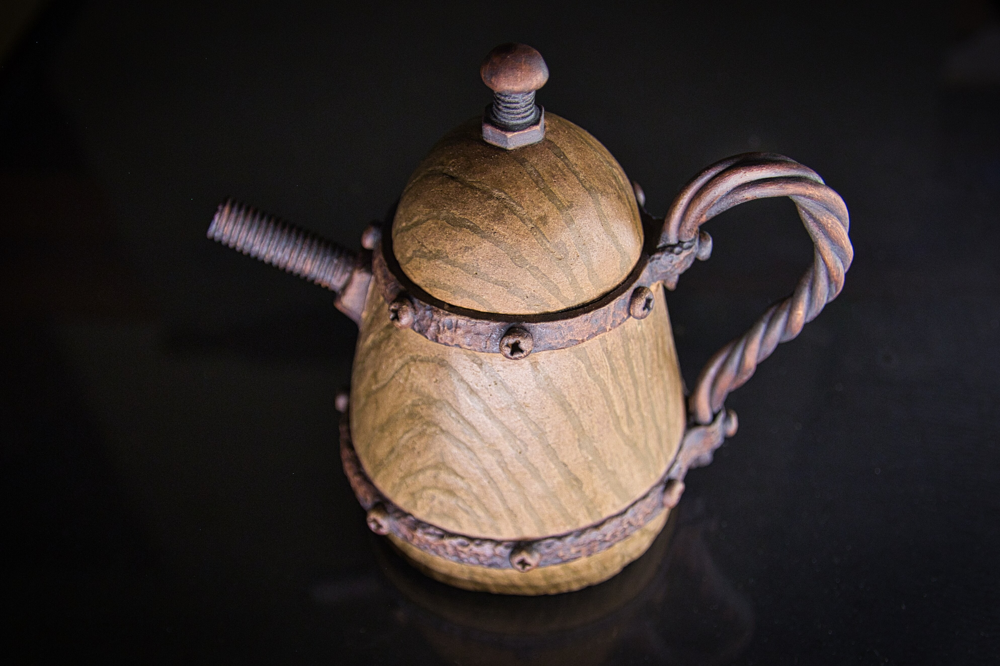
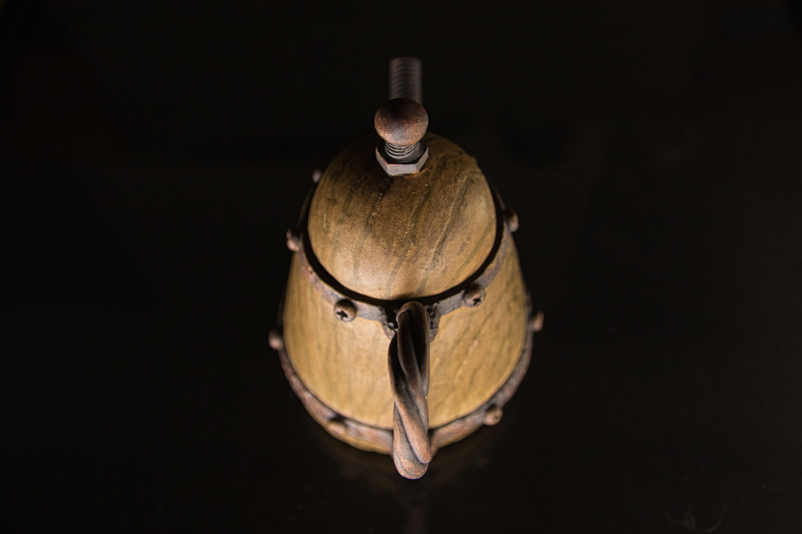
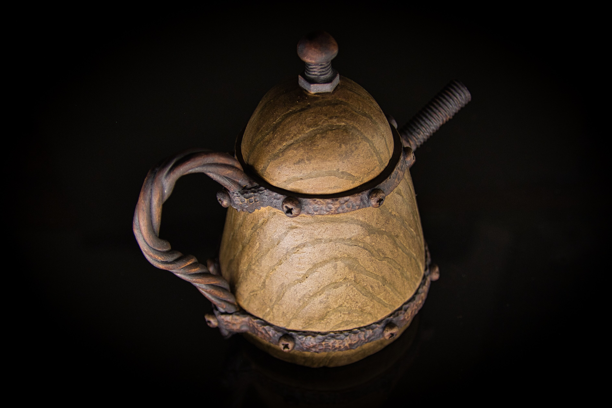

# 「虛木幻鐵」壺

作品名稱: 虛木幻鐵
創作年份: 2024
創作理念: 「這隻茶壺的壺身紋路，宛如天然木材的紋理，展現了陶藝家對材料的精湛掌控和技巧。壺把和壺嘴的鐵器質感，則是陶藝家對不同材質的融合和創新的嘗試。更令人驚艷的是，陶藝家竟然使用螺絲作為壺嘴的造型，展現了其對工藝的創意和對細節的關注。這隻茶壺不僅是一件藝術品，也是一件展現陶藝家技術與經驗水平的傑作。」
Tag: 木桶, 螺絲, 釘, 銹, 鐵

