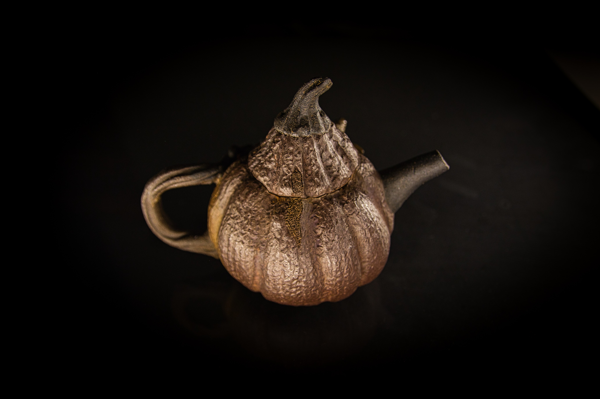

# 南瓜同樂壺

作品名稱: 南瓜瓢蟲壺
創作年份: 2024
創作理念: 「這隻南瓜同樂壺，宛如一顆成熟的南瓜，身上搭載著一群可愛的朋友。蝸牛、毛毛蟲和瓢蟲，三種不同的生物，共同在南瓜上創造了一個小小的生態系統。每個生物的細節，從觸角到翅膀，都被精心刻畫，展現了陶藝家的技巧和耐心。南瓜的紋理和顏色，也被巧妙地呈現，給人一種對自然的親切感。這隻壺，不僅是一件藝術品，也是一件充滿童趣和幽默的裝飾品。」
Tag: 南瓜, 毛毛蟲, 瓢蟲, 蝸牛

