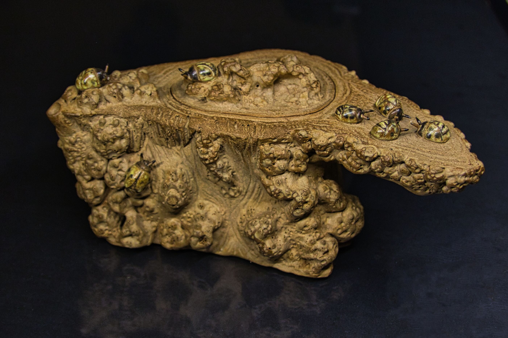
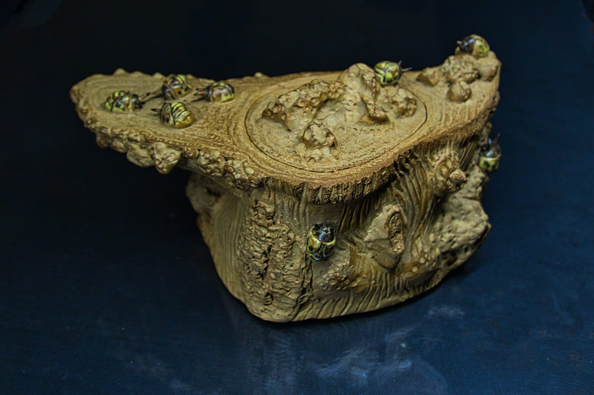

# 密林樹瘤之瓢蟲壺

作品名稱: 樹瘤密林之瓢壺
作品規格: 22*13*11(cm)
創作年份: 2024
創作理念: 密林樹瘤之瓢蟲壺，其設計靈感來自於大自然。體現了樹瘤的特色，更具備了獨特紋路的側把。最引人注目的是，壺身上裝飾著十隻繽紛活潑的瓢蟲，它們在樹瘤般的茶壺上點綴著，猶如於森林中快樂的穿梭。每個細節都雕塑得精緻細膩，將大自然的神奇與寧靜感覺完美融合，令您每次啜飲茶湯，都能讓人仿佛置身於大自然之中，享受那份寧靜與祥和。
Tag: 側把, 樹瘤, 瓢蟲

