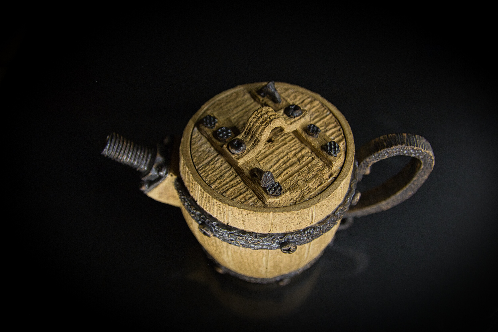
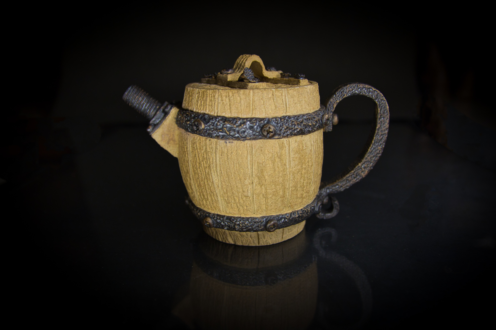
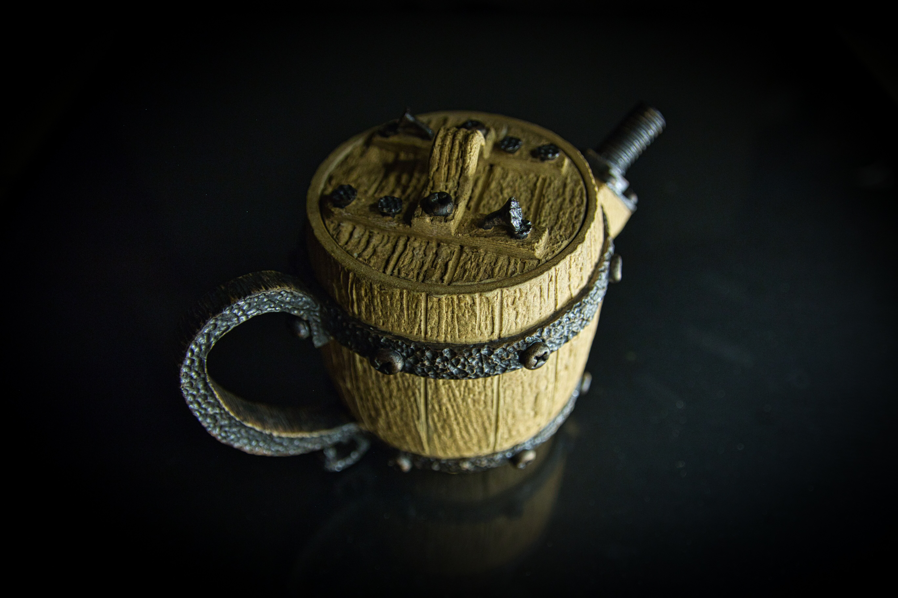

# 橡木桶鐵器壺

作品名稱: 橡木桶鐵器壺
創作年份: 2024
創作理念: 「這隻茶壺是陶藝家技術與創意的結合。壺身的木頭紋路，是對陶土材料的巧妙運用。壺把和壺嘴的鐵器質感，是對不同材質的融合和創新的嘗試。螺絲壺嘴的造型，壺蓋上的螺絲、鐵釘，更是展現了陶藝家對工藝的創意和對細節的關注。這隻茶壺是一件真正的工藝傑作，展現了陶藝家多年的經驗和技術水平。」
Tag: 木, 木桶, 螺絲, 釘, 鐵

